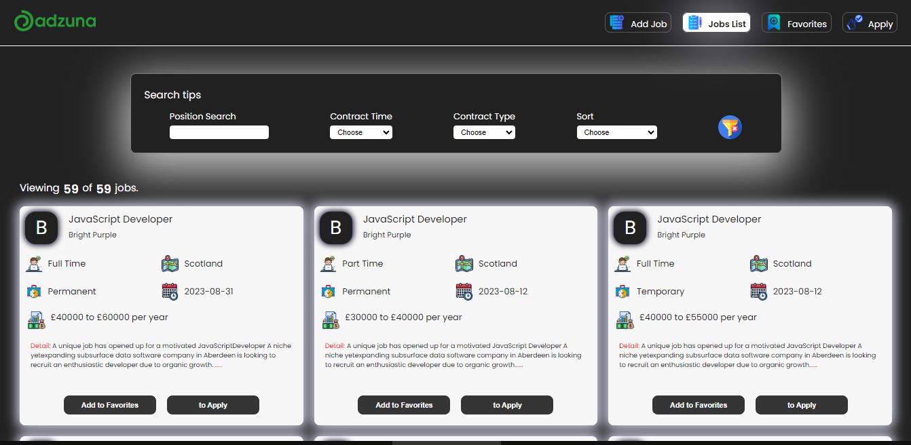

# React + Redux Toolkit Projesi - İş Arama Modülü

## JobSearch-ReduxToolkit
- Bu proje, iş arama işlemlerini kolaylaştırmak için React ve Redux Toolkit kullanılarak geliştirilmiştir. Aşağıda projenin temel özellikleri ve kullanılan kütüphaneler hakkında daha fazla bilgi bulabilirsiniz.

# Özellikler
- API Entegrasyonu: Adzuna API kullanılarak iş ilanları listesi alınır ve Json Server ile veritabanına eklenir.

- Favori ve Başvuru Listeleri: Axios ile sunucudan favori ve başvuru listeleri alınır. Ayrıca bu listelere iş ilanları eklemek ve silmek mümkündür.

- İş Ekleme: Yeni iş ilanları eklemek için sunucu ile iletişim kurmak için post isteği gönderilebilir.

- İş Detayları: İş listesindeki her iş ilanının detaylarına erişim sağlanır ve ilgili iş ilanının web sitesine yönlendirme yapılır.

- Responsive Tasarım: Proje, farklı ekran boyutlarına uyumlu olacak şekilde tasarlanmıştır.

- API : http://api.adzuna.com/v1
- Json Server :  http://localhost:3050

# Kullanılan Kütüphaneler
react-router-dom
react-toastify
sass
axios
json-server
@reduxjs/toolkit
react-redux
uuid

## Önizleme

Bu projeyi daha da geliştirmek ve kullanıcılar için daha işlevsel hale getirmek için birlikte çalışmayı dört gözle bekliyoruz. İyi kodlamalar! 😊# JobsSearch-List-Filter-Redux_Toolkit
